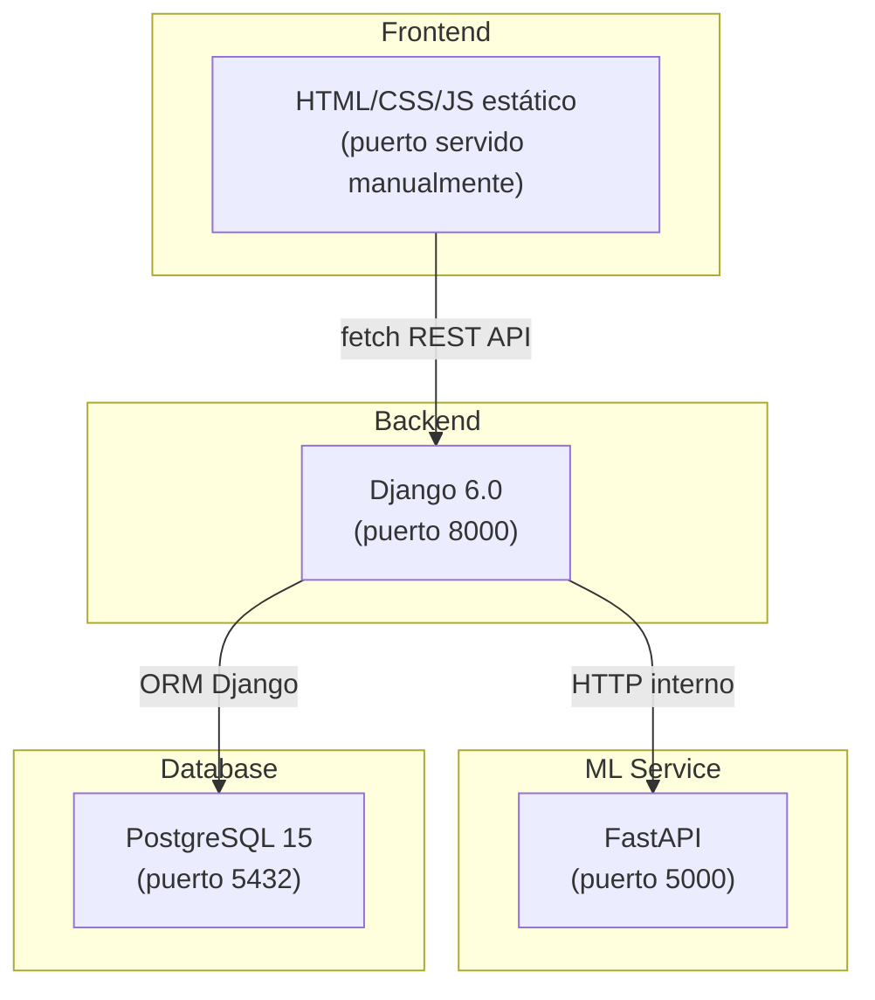
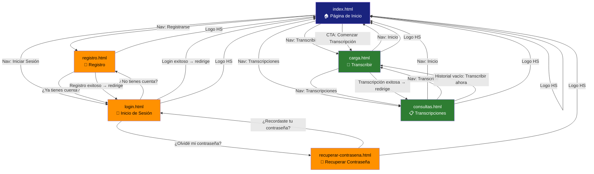
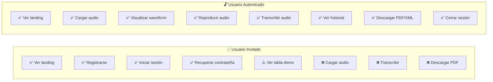

# Análisis Exhaustivo del Proyecto HarmonicScore_TT

> **Proyecto:** Harmonic Score — Transcripción Automática de Música con IA  
> **Institución:** ESCOM-IPN | Proyecto Académico 2026-B115  
> **Equipo:** Arroyo Parra Jair Uziel, Cano Portugal Israel Daniel Arturo, Garcés Valencia Brisa Isabel  
> **Fecha de análisis:** 23/04/2026

---

## 1. Arquitectura General del Sistema

El proyecto está organizado como una aplicación de **3 capas** orquestada con Docker Compose:

| Capa | Tecnología | Estado |
|------|-----------|--------|
| **Frontend** | HTML5, CSS3 (Vanilla), JavaScript (Vanilla), WaveSurfer.js 7 | Funcional (prototipo visual) |
| **Backend** | Django 6.0.3, Python, `django-cors-headers` | Parcialmente implementado (3 endpoints reales) |
| **ML Service** | FastAPI, Pydantic | Scaffold/placeholder |
| **Base de datos** | PostgreSQL 15 (Docker) / SQLite3 (desarrollo local) | Modelo `auth.User` de Django |
| **Contenedores** | Docker Compose 3.9 | Configurado, con soporte GPU para ML |

---

## 2. Inventario Completo de Archivos

### 2.1 Páginas HTML (Frontend)

| Archivo | Propósito | Accesible sin sesión |
|---------|----------|---------------------|
| [index.html](file:///c:/Users/coman/Downloads/ESCOM/Trabajo%20terminal/armonicgit/HarmonicScore_TT/frontend/src/harmonic-score/index.html) | Landing page / Página de inicio | ✅ Sí |
| [login.html](file:///c:/Users/coman/Downloads/ESCOM/Trabajo%20terminal/armonicgit/HarmonicScore_TT/frontend/src/harmonic-score/login.html) | Inicio de sesión | ✅ Sí |
| [registro.html](file:///c:/Users/coman/Downloads/ESCOM/Trabajo%20terminal/armonicgit/HarmonicScore_TT/frontend/src/harmonic-score/registro.html) | Registro de usuario | ✅ Sí |
| [recuperar-contrasena.html](file:///c:/Users/coman/Downloads/ESCOM/Trabajo%20terminal/armonicgit/HarmonicScore_TT/frontend/src/harmonic-score/recuperar-contrasena.html) | Recuperación de contraseña | ✅ Sí |
| [carga.html](file:///c:/Users/coman/Downloads/ESCOM/Trabajo%20terminal/armonicgit/HarmonicScore_TT/frontend/src/harmonic-score/carga.html) | Carga de audio y transcripción | ⚠️ Visible pero bloqueada |
| [consultas.html](file:///c:/Users/coman/Downloads/ESCOM/Trabajo%20terminal/armonicgit/HarmonicScore_TT/frontend/src/harmonic-score/consultas.html) | Historial de transcripciones | ⚠️ Visible pero bloqueada |

### 2.2 Archivos JavaScript

| Archivo | Responsabilidad |
|---------|----------------|
| [sesion.js](file:///c:/Users/coman/Downloads/ESCOM/Trabajo%20terminal/armonicgit/HarmonicScore_TT/frontend/src/harmonic-score/js/sesion.js) | Gestión de sesión (localStorage), widget de usuario, protección de botones para invitados |
| [config.js](file:///c:/Users/coman/Downloads/ESCOM/Trabajo%20terminal/armonicgit/HarmonicScore_TT/frontend/src/harmonic-score/js/config.js) | Constantes globales (tiempos, límites, mensajes) |
| [navigation.js](file:///c:/Users/coman/Downloads/ESCOM/Trabajo%20terminal/armonicgit/HarmonicScore_TT/frontend/src/harmonic-score/js/navigation.js) | Marca el enlace activo en la barra de navegación |
| [main.js](file:///c:/Users/coman/Downloads/ESCOM/Trabajo%20terminal/armonicgit/HarmonicScore_TT/frontend/src/harmonic-score/js/main.js) | Inicialización, animaciones scroll, utilidades de formato |
| [api.js](file:///c:/Users/coman/Downloads/ESCOM/Trabajo%20terminal/armonicgit/HarmonicScore_TT/frontend/src/harmonic-score/js/api.js) | Cliente HTTP para Django (fetch wrapper con CSRF) |
| [validacion.js](file:///c:/Users/coman/Downloads/ESCOM/Trabajo%20terminal/armonicgit/HarmonicScore_TT/frontend/src/harmonic-score/js/validacion.js) | Validación de formularios: registro, login, recuperar contraseña, reCAPTCHA |
| [transcripcion.js](file:///c:/Users/coman/Downloads/ESCOM/Trabajo%20terminal/armonicgit/HarmonicScore_TT/frontend/src/harmonic-score/js/transcripcion.js) | Lógica del proceso de transcripción (subida, progreso, modal) |
| [transcripciones.js](file:///c:/Users/coman/Downloads/ESCOM/Trabajo%20terminal/armonicgit/HarmonicScore_TT/frontend/src/harmonic-score/js/transcripciones.js) | Gestión de la tabla de historial, renderizado, descarga PDF |
| [wavesurfer-setup.js](file:///c:/Users/coman/Downloads/ESCOM/Trabajo%20terminal/armonicgit/HarmonicScore_TT/frontend/src/harmonic-score/js/wavesurfer-setup.js) | Inicialización de WaveSurfer.js, carga/validación de archivo, visualización |

### 2.3 Backend Django

| Archivo | Responsabilidad |
|---------|----------------|
| [views.py](file:///c:/Users/coman/Downloads/ESCOM/Trabajo%20terminal/armonicgit/HarmonicScore_TT/backend/app/views.py) | 3 vistas: `registro_usuario`, `recuperar_contrasena`, `subir_transcripcion` |
| [urls.py](file:///c:/Users/coman/Downloads/ESCOM/Trabajo%20terminal/armonicgit/HarmonicScore_TT/backend/app/urls.py) | Rutas API: `/api/auth/registro/`, `/api/auth/recuperar-contrasena/`, `/api/transcripciones/subir/` |
| [settings.py](file:///c:/Users/coman/Downloads/ESCOM/Trabajo%20terminal/armonicgit/HarmonicScore_TT/backend/app/settings.py) | Configuración Django (SQLite3 local, CORS abierto, DEBUG=True) |

### 2.4 Endpoints Backend Implementados

| Método | Endpoint | Función | Estado |
|--------|----------|---------|--------|
| `POST` | `/api/auth/registro/` | Registro de usuario con reCAPTCHA | ✅ **Funcional** |
| `POST` | `/api/auth/login/` | Inicio de sesión | ❌ **No implementado** (simulado en frontend) |
| `POST` | `/api/auth/recuperar-contrasena/` | Verificar correo para recuperación | ✅ **Funcional** (sin envío real de email) |
| `POST` | `/api/transcripciones/subir/` | Subir archivo de audio | ✅ **Funcional** (sin procesamiento ML real) |
| `GET`  | `/api/transcripciones/mis/` | Obtener historial del usuario | ❌ **No implementado** |

---

## 3. Mapa de Navegación Completo

### Barra de Navegación (Header)

La barra de navegación varía dependiendo de la página y el estado de sesión:

| Enlace | Visible en `index.html` | Visible en `carga.html` | Visible en `consultas.html` | Visible en `login.html` | Visible en `registro.html` |
|--------|:-:|:-:|:-:|:-:|:-:|
| Inicio | ✅ | ✅ | ✅ | ❌ | ❌ |
| Transcribir | ✅ | ✅ | ✅ | ❌ | ❌ |
| Transcripciones | ✅ | ✅ | ✅ | ❌ | ❌ |
| Registrarse | ✅ | ✅ | ✅ | ❌ | ❌ |
| Iniciar Sesión | ✅ | ✅ | ✅ | ❌ | ❌ |

> [!IMPORTANT]
> Cuando hay **sesión activa**, los enlaces "Registrarse" e "Iniciar Sesión" se **ocultan automáticamente** y se reemplazan por un **widget de usuario** (`👤 nombre_usuario`) con dropdown para cerrar sesión.

---

## 4. Comportamiento por Tipo de Usuario

### 4.1 Usuario Invitado (Sin sesión activa)

El usuario invitado **puede ver todas las páginas** pero tiene **acciones bloqueadas** en las funcionalidades principales.

| Acción | ¿Permitida? | Comportamiento al intentar |
|--------|:-----------:|--------------------------|
| Ver landing page completa | ✅ | Acceso libre |
| Navegar a cualquier página | ✅ | Acceso libre |
| Ver sección "Cómo funciona" en landing | ✅ | Acceso libre |
| Ver sección "Características" en landing | ✅ | Acceso libre |
| Registrarse | ✅ | Formulario completo funcional |
| Iniciar sesión | ✅ | Formulario completo funcional |
| Solicitar recuperación de contraseña | ✅ | Formulario funcional contra backend |
| Ver Términos y Condiciones (modal en registro) | ✅ | Modal funcional |
| Hacer clic en "Examinar" (carga.html) | ❌ | **Redirige a `login.html`** |
| Arrastrar archivo al drop zone | ❌ | **Redirige a `login.html`** |
| Hacer clic en el drop zone | ❌ | **Redirige a `login.html`** |
| Reproducir audio (btn-play) | ❌ | **Redirige a `login.html`** |
| Transcribir (btn-transcribir) | ❌ | **Redirige a `login.html`** |
| Ver tabla de transcripciones (consultas.html) | ⚠️ | Ve **datos de ejemplo** (4 registros demo) |
| Descargar PDF de transcripción | ❌ | **Redirige a `login.html`** |
| Hacer clic en "Transcribir ahora" (estado vacío) | ❌ | **Redirige a `login.html`** |
| Ver widget de usuario en header | ❌ | No aparece |
| Cerrar sesión | ❌ | No hay sesión que cerrar |

> [!NOTE]
> La protección se implementa en [sesion.js](file:///c:/Users/coman/Downloads/ESCOM/Trabajo%20terminal/armonicgit/HarmonicScore_TT/frontend/src/harmonic-score/js/sesion.js#L224-L259) mediante la función `protegerBotonesInvitado()`, que intercepta clics en elementos protegidos con `event.preventDefault()` + `stopImmediatePropagation()` y redirige a `login.html`. Adicionalmente, [wavesurfer-setup.js](file:///c:/Users/coman/Downloads/ESCOM/Trabajo%20terminal/armonicgit/HarmonicScore_TT/frontend/src/harmonic-score/js/wavesurfer-setup.js#L122-L132) tiene su propia función `cancelarInvitado()` como segunda capa de protección.

### 4.2 Usuario con Sesión Activa (Autenticado)

El usuario autenticado tiene **acceso completo** a todas las funcionalidades implementadas.

| Acción | ¿Permitida? | Detalle |
|--------|:-----------:|--------|
| Ver landing page completa | ✅ | Acceso libre |
| Navegar entre páginas | ✅ | Sin "Registrarse" ni "Iniciar Sesión" en nav |
| Ver widget de usuario `👤 nombre` | ✅ | Aparece en header de todas las páginas |
| Cerrar sesión (dropdown) | ✅ | Limpia localStorage, redirige a `login.html` |
| Cargar archivo de audio (examinar / drop) | ✅ | Abre explorador de archivos |
| Arrastrar y soltar archivo | ✅ | Funcional con feedback visual |
| Visualizar forma de onda (WaveSurfer) | ✅ | Espectrograma interactivo |
| Ver información del archivo (nombre, peso, duración, formato) | ✅ | Panel lateral actualizado dinámicamente |
| Ver clasificación IA del audio | ✅ | Muestra "Polifónico (Piano)" simulado |
| Reproducir / pausar audio | ✅ | Control con WaveSurfer |
| Transcribir archivo cargado | ✅ | Envía archivo al backend, muestra modal de progreso |
| Ver barra de progreso (modal / mini) | ✅ | Modal con opción de minimizar |
| Ver historial de transcripciones | ✅ | Tabla o estado vacío según datos |
| Descargar PDF/XML de transcripción | ✅ | Simulado (80% éxito, 20% error para demo) |
| Ver leyenda de estados | ✅ | ✓ Completado / ✗ Error / ⊖ En Proceso |

> [!NOTE]
> La sesión se persiste en `localStorage` con 3 claves: `hs_username`, `hs_token`, `hs_logged_in`. Se gestiona mediante el objeto `Sesion` en [sesion.js](file:///c:/Users/coman/Downloads/ESCOM/Trabajo%20terminal/armonicgit/HarmonicScore_TT/frontend/src/harmonic-score/js/sesion.js#L9-L45).

---

## 5. Casos de Uso Detallados

---

### CU-01: Registro de Usuario

| Campo | Valor |
|-------|-------|
| **Actor principal** | Usuario Invitado |
| **Página** | `registro.html` |
| **Backend endpoint** | `POST /api/auth/registro/` |
| **Estado** | ✅ **Completamente implementado (frontend + backend)** |

#### Precondiciones
- El usuario no tiene cuenta registrada.
- El usuario accede a `registro.html`.

#### Flujo Principal
1. El usuario completa el formulario con: **Nombres**, **Apellidos**, **Correo**, **Nombre de usuario**, **Contraseña**, **Confirmar contraseña**.
2. El usuario hace clic en el enlace **"He leído y acepto los Términos y Condiciones"**.
3. Se abre un **modal** con el texto completo de los Términos (10 cláusulas).
4. El usuario hace **scroll hasta el final** del texto → se habilita el botón **"Acepto"**.
5. El usuario hace clic en **"Acepto"** → el checkbox se marca, el botón "Registrarse" se habilita.
6. El usuario completa el **reCAPTCHA de Google**.
7. El usuario hace clic en **"Registrarse"**.
8. El frontend valida:
   - Campos no vacíos.
   - Contraseña cumple PCI-DSS: ≥8 caracteres, ≥1 mayúscula, ≥1 símbolo especial.
   - Contraseñas coinciden.
   - reCAPTCHA verificado.
9. El frontend envía datos al backend via `DjangoAPI.registrarUsuario()`.
10. El backend:
    - Verifica el token reCAPTCHA con la API de Google.
    - Valida que el correo no exista en la BD.
    - Valida que el nombre de usuario no exista en la BD.
    - Crea el usuario con `User.objects.create_user()` (contraseña hasheada automáticamente).
11. **msn1:** *"Cuenta registrada exitosamente"* (verde).
12. Redirige a `login.html` después de 2 segundos.

#### Flujos Alternos

| Código | Condición | Mensaje (msn) | Color |
|--------|-----------|---------------|-------|
| FA-01 | Campos vacíos | "Error al registrar cuenta: Faltan completar los siguientes campos (lista)" | 🔴 Rojo |
| FA-02 | Contraseña no cumple PCI-DSS | "Error al registrar cuenta: La contraseña debe tener al menos 8 caracteres, 1 mayúscula y 1 símbolo especial." | 🔴 Rojo |
| FA-03 | Contraseñas no coinciden | "Error al registrar cuenta: Las contraseñas no coinciden." | 🔴 Rojo |
| FA-04 | reCAPTCHA no completado | "Error al registrar cuenta: Completa la verificación reCAPTCHA." | 🔴 Rojo |
| FA-05 | Correo ya registrado (backend) | "Este correo ya está registrado" | 🔴 Rojo |
| FA-06 | Usuario ya registrado (backend) | "Este nombre de usuario ya está registrado" | 🔴 Rojo |
| FA-07 | Captcha inválido (backend) | "Error de verificación: El captcha no es válido. Intenta de nuevo." | 🔴 Rojo |
| FA-08 | Error de conexión | "Error al registrar cuenta: Problema de conexión" | 🔴 Rojo |
| FA-09 | Error genérico (backend) | "Error al registrar cuenta" | 🔴 Rojo |

#### Validación de Términos y Condiciones (Sub-flujo)
- El botón "Acepto" está **deshabilitado** hasta hacer scroll al fondo.
- El botón "Declinar" cierra el modal y desmarca el checkbox.
- El botón "Registrarse" está **deshabilitado** hasta aceptar términos.
- El checkbox se puede marcar/desmarcar manualmente (sin abrir modal).

---

### CU-02: Inicio de Sesión

| Campo | Valor |
|-------|-------|
| **Actor principal** | Usuario registrado |
| **Página** | `login.html` |
| **Backend endpoint** | `POST /api/auth/login/` |
| **Estado** | ⚠️ **Frontend completo, backend NO implementado (login simulado)** |

#### Precondiciones
- El usuario tiene una cuenta registrada.

#### Flujo Principal
1. El usuario introduce **correo electrónico** y **contraseña**.
2. El usuario completa el **reCAPTCHA de Google**.
3. El usuario hace clic en **"Ingresar"**.
4. El frontend valida campos no vacíos y reCAPTCHA.
5. **[SIMULADO]** El frontend recupera el nombre de usuario desde `localStorage` (guardado previamente durante el registro) o el prefijo del correo.
6. Se guarda la sesión: `Sesion.iniciar(nombre, 'token-simulado')`.
7. **msn1:** *"Bienvenido, [nombre_usuario]"* (verde).
8. Redirige a `index.html` después de 1.2 segundos.

> [!WARNING]
> El endpoint `POST /api/auth/login/` **no existe en el backend**. La autenticación actualmente es **simulada** en el frontend. El código real del backend está comentado en [validacion.js](file:///c:/Users/coman/Downloads/ESCOM/Trabajo%20terminal/armonicgit/HarmonicScore_TT/frontend/src/harmonic-score/js/validacion.js#L380-L392) (líneas 380-392), listo para activarse cuando el endpoint esté disponible.

#### Flujos Alternos

| Código | Condición | Mensaje (msn) | Color |
|--------|-----------|---------------|-------|
| FA-01 | Campos vacíos | "Correo o contraseña inválidos" | 🔴 Rojo |
| FA-02 | reCAPTCHA no completado | "Error: Completa la verificación reCAPTCHA." | 🔴 Rojo |
| FA-03 | Credenciales inválidas (futuro) | "Correo o contraseña inválidos" | 🔴 Rojo |
| FA-04 | Error del servidor (futuro) | "Ups, tenemos un problema desde nuestro lado" | 🔴 Rojo |

#### Navegación Adicional
- Link **"¿Olvidé mi contraseña?"** → `recuperar-contrasena.html`
- Link **"¿No tienes cuenta? Regístrate aquí"** → `registro.html`

---

### CU-03: Recuperar Contraseña

| Campo | Valor |
|-------|-------|
| **Actor principal** | Usuario registrado que olvidó su contraseña |
| **Página** | `recuperar-contrasena.html` |
| **Backend endpoint** | `POST /api/auth/recuperar-contrasena/` |
| **Estado** | ⚠️ **Verificación de correo funcional, envío de email NO implementado** |

#### Precondiciones
- El usuario tiene una cuenta registrada pero no recuerda su contraseña.

#### Flujo Principal
1. El usuario introduce su **correo electrónico registrado**.
2. Hace clic en **"Enviar enlace de recuperación"**.
3. El botón cambia a **"Enviando..."** y se deshabilita temporalmente.
4. El frontend envía la petición al backend via `DjangoAPI.peticion('/auth/recuperar-contrasena/', 'POST', { email })`.
5. El backend busca el correo en la BD (`User.objects.filter(email__iexact=email)`).
6. **Si el correo existe:**
   - **msn1:** *"Se ha enviado la recuperación a tu correo"* (verde).
   - **[TODO]** El backend deberá generar un token de 24h y enviar un correo real.
7. **Si el correo NO existe:**
   - **msn2:** *"Error al recuperar contraseña"* (rojo).
8. El botón vuelve a su estado original.

#### Flujos Alternos

| Código | Condición | Mensaje (msn) | Color |
|--------|-----------|---------------|-------|
| FA-01 | Campo correo vacío | "Error al recuperar contraseña: ingresa tu correo." | 🔴 Rojo |
| FA-02 | Correo no encontrado (404) | "Error al recuperar contraseña" | 🔴 Rojo |
| FA-03 | Error de conexión | "Error al recuperar contraseña" | 🔴 Rojo |

#### Navegación Adicional
- Link **"¿Recordaste tu contraseña? Inicia sesión aquí"** → `login.html`

---

### CU-04: Carga de Archivo de Audio

| Campo | Valor |
|-------|-------|
| **Actor principal** | Usuario autenticado |
| **Página** | `carga.html` |
| **Estado** | ✅ **Completamente implementado (frontend)** |

#### Precondiciones
- El usuario tiene sesión activa.
- El usuario accede a `carga.html`.

#### Flujo Principal
1. El usuario puede cargar un archivo de dos formas:
   - **a)** Hacer clic en el botón **"Examinar"** → abre explorador de archivos del SO.
   - **b)** **Arrastrar y soltar** un archivo sobre la zona de drop.
2. El frontend valida el archivo:
   - **Formato:** Solo `.mp3` o `.wav` (validación por extensión).
   - **Tamaño:** Máximo 50 MB.
3. Si el archivo es válido:
   - Se almacena en la variable global `archivoActual`.
   - Se actualiza visualmente la zona de carga (icono 🎶, fondo verde, texto "¡Archivo cargado con éxito!").
   - Se muestra el **panel de detalles del audio**: nombre, peso (MB), formato (extensión en mayúsculas).
   - Se carga el archivo en **WaveSurfer.js** generando un espectrograma interactivo.
4. Cuando WaveSurfer termina de cargar (`ready`):
   - Se valida la **duración máxima**: 6 minutos (360 segundos).
   - Se muestra la duración en formato `M:SS`.
   - Se habilita el botón **"✨ ¡Transcribir!"**.
   - Se muestra la **clasificación IA simulada**: *"Polifónico (Piano)"* (después de 2 segundos).
   - **msn1:** `alert('Archivo cargado correctamente')`.

#### Flujos Alternos

| Código | Condición | Mensaje (msn) | Tipo |
|--------|-----------|---------------|------|
| FA-01 | Formato no soportado | "Formato no soportado. Solo se aceptan archivos MP3 o WAV" | Modal error |
| FA-02 | Tamaño > 50 MB | "Tamaño excedido. El archivo no debe superar los 50 MB" | Modal error |
| FA-03 | Duración > 6 minutos | "Duración excedida. El archivo no debe superar los 6 minutos" | Modal error |
| FA-04 | Usuario invitado intenta cargar | Redirige a `login.html` | Redirección |

#### Funcionalidades de WaveSurfer
- Visualización de forma de onda con colores configurados (naranja/azul).
- Cursor rojo para posición actual.
- Plugin de **Regions** (selección de rango de audio).
- Plugin de **Timeline** (marcas de tiempo).
- Botón **"▶ Reproducir Selección"** → play/pause del audio.
- El botón cambia su texto dinámicamente: "Reproducir Selección" ↔ "Pausar".

---

### CU-05: Transcripción de Audio

| Campo | Valor |
|-------|-------|
| **Actor principal** | Usuario autenticado |
| **Página** | `carga.html` |
| **Backend endpoint** | `POST /api/transcripciones/subir/` |
| **Estado** | ⚠️ **Frontend completo, backend scaffold (simulación ML con sleep 2s)** |

#### Precondiciones
- El usuario ha cargado un archivo de audio válido (CU-04 completado).
- El botón "✨ ¡Transcribir!" está habilitado.

#### Flujo Principal
1. El usuario hace clic en **"✨ ¡Transcribir!"**.
2. Se verifica que exista un archivo válido en `archivoActual`.
3. Se abre el **modal de progreso** con:
   - Título: *"Transcribiendo..."*
   - Texto: *"Por favor espera mientras procesamos tu audio."*
   - Barra de progreso visual al 50% con texto "En proceso...".
   - Nota: *"Esto puede tomar hasta 1 minuto."*
   - Botón **"Minimizar"** (cierra modal, muestra barra mini en panel lateral).
4. Se envía el archivo al backend como `FormData` via `DjangoAPI.peticion('/transcripciones/subir/', 'POST', formData)`.
5. El backend:
   - Valida que se recibió un archivo `audio` en `request.FILES`.
   - Valida que el tamaño no supere 50 MB.
   - **[TODO]** Clasificar, generar CQT, ejecutar modelo YourMT3, post-procesar.
   - Simula procesamiento con `time.sleep(2)`.
   - Responde `{ success: true, message: "Transcripción completada" }`.
6. El frontend actualiza la barra al 100%.
7. **msn1:** `alert('Transcripción completada. Redirigiendo a consultas...')`.
8. Redirige a `consultas.html`.

#### Flujos Alternos

| Código | Condición | Mensaje (msn) | Tipo |
|--------|-----------|---------------|------|
| FA-01 | No hay archivo seleccionado | "No hay ningún archivo válido seleccionado para transcribir." | Modal error |
| FA-02 | Error del servidor | "Error en el procesamiento. [detalle]" | Modal error |
| FA-03 | Error de conexión | "Error en el procesamiento. Verifica tu conexión con el servidor." | Modal error |

#### Modal de Progreso — Interacciones
- **Botón "Minimizar"**: Cierra el modal, muestra barra de progreso mini en el panel de detalles.
- **Botón "✕" (cerrar)**: Misma acción que minimizar.
- **Clic fuera del modal**: Misma acción que minimizar.
- La transcripción **continúa en segundo plano** al minimizar.

---

### CU-06: Consulta y Descarga de Transcripciones

| Campo | Valor |
|-------|-------|
| **Actor principal** | Usuario autenticado |
| **Página** | `consultas.html` |
| **Backend endpoint** | `GET /api/transcripciones/mis/` |
| **Estado** | ⚠️ **Frontend completo, backend NO implementado (datos simulados)** |

#### Precondiciones
- El usuario tiene sesión activa.
- El usuario accede a `consultas.html`.

#### Flujo Principal (Usuario autenticado)
1. Al cargar la página, `Transcripciones.cargarDesdeBackend()` se ejecuta automáticamente.
2. **[SIMULADO]** Si no hay endpoint backend, se busca en `localStorage('hs_mock_historial')`.
3. **Si hay datos:**
   - Se renderizan en tabla con columnas: **Título**, **Fecha Trans.**, **Estado**, **Descargar**.
   - Se muestra la **leyenda** de estados.
   - **Popup:** *"Historial cargado"* (notificación).
4. **Si no hay datos:**
   - Se muestra **estado vacío**: icono 🎵, texto *"Aún no tienes transcripciones"*, botón **"Transcribir ahora"** → `carga.html`.
   - **Popup:** *"Historial cargado"* (notificación).

#### Flujo Principal (Usuario invitado)
1. Se renderizan **4 registros de ejemplo** fijos (datos demo):
   - `"1.mp3"` | 15/5/26 | ✅ Completado
   - `"2.mp3"` | 10/6/26 | ❌ Error
   - `"3.mp3"` | 11/6/26 | ⊖ En Proceso
   - `"ejercicio_piano.wav"` | 12/6/26 | ✅ Completado
2. Los botones de descarga **redirigen a `login.html`** al hacer clic.

#### Estados de Transcripción

| Estado | Visual | Botón Descarga |
|--------|--------|---------------|
| `completado` | ✓ Completado (verde) | `PDF/XML ↓` (botón azul) |
| `error` | ✗ Error (rojo) | "Error" (texto rojo) |
| `proceso` | ⊖ En Proceso (amarillo) | "--" |

#### Descarga de PDF (Simulación)
- Al hacer clic en **"PDF/XML ↓"**, se ejecuta `Transcripciones.descargarPDF()`.
- Si es invitado → redirige a `login.html`.
- Probabilidad simulada: **80% éxito / 20% error** (para demostración del caso de uso).
  - **Éxito:** Popup *"Descarga iniciada"* (notificación).
  - **Error:** Popup *"Error al generar PDF"* (error).

---

### CU-07: Cerrar Sesión

| Campo | Valor |
|-------|-------|
| **Actor principal** | Usuario autenticado |
| **Componente** | Widget de sesión en header (todas las páginas) |
| **Estado** | ✅ **Completamente implementado (frontend)** |

#### Precondiciones
- El usuario tiene sesión activa.

#### Flujo Principal
1. El usuario posiciona el cursor sobre el widget `👤 nombre_usuario` en el header.
2. Se despliega un dropdown con el botón **"🚪 Cerrar sesión"**.
3. El usuario hace clic en **"Cerrar sesión"**.
4. Se ejecuta `Sesion.cerrar()`:
   - Se eliminan las 3 claves de `localStorage`: `hs_username`, `hs_token`, `hs_logged_in`.
   - Se redirige a `login.html`.
5. La navegación vuelve a mostrar "Registrarse" e "Iniciar Sesión".

---

## 6. Resumen Comparativo: Invitado vs. Autenticado

| Funcionalidad | Invitado | Autenticado |
|:---|:---:|:---:|
| Ver landing page (index.html) | ✅ | ✅ |
| Navegar entre páginas | ✅ | ✅ |
| Registrar cuenta | ✅ | N/A |
| Iniciar sesión | ✅ | N/A |
| Recuperar contraseña | ✅ | N/A |
| Ver Términos y Condiciones | ✅ | ✅ |
| Widget de sesión en header | ❌ | ✅ |
| Botón Examinar / cargar archivo | ❌ → login | ✅ |
| Drag & Drop de archivo | ❌ → login | ✅ |
| Visualizar espectrograma | ❌ → login | ✅ |
| Reproducir audio | ❌ → login | ✅ |
| Ver detalles del audio | ❌ → login | ✅ |
| Ver predicción IA | ❌ → login | ✅ |
| Transcribir archivo | ❌ → login | ✅ |
| Ver modal de progreso | ❌ → login | ✅ |
| Ver historial de transcripciones | ⚠️ (datos demo) | ✅ (datos reales/vacío) |
| Descargar PDF/XML | ❌ → login | ✅ |
| Cerrar sesión | N/A | ✅ |

---

## 7. Elementos Pendientes de Implementación

> [!CAUTION]
> Los siguientes elementos están en el código como **TODO/scaffolding** y requieren implementación futura.

| Elemento | Ubicación | Detalles |
|----------|----------|---------|
| **Endpoint Login** | Backend `views.py` | No existe la vista `login_usuario`. El frontend tiene el código comentado listo. |
| **Endpoint historial** | Backend `urls.py` | `GET /api/transcripciones/mis/` no existe. La tabla se renderiza con datos mock. |
| **Envío real de email** | Backend `views.py:95` | La recuperación de contraseña verifica el correo pero no envía email real. |
| **Token de recuperación (24h)** | Backend `views.py:95` | No se genera token temporal para reset de contraseña. |
| **Modelo ML YourMT3** | `ml-service/app.py` | Solo tiene un endpoint placeholder `/analyze` sin lógica real. |
| **Clasificación audio** | `views.py:134` | TODO: Clasificar audio (Monofónico/Polifónico) por entropía espectral. |
| **Generación CQT** | `views.py:135` | TODO: Generar representación CQT con Librosa. |
| **Post-procesamiento** | `views.py:137` | TODO: Cuantización, Fusión, Armónicos. |
| **Validación MIME** | `views.py:129` | TODO: Validar cabecera binaria real del archivo. |
| **Descarga real PDF/XML** | Frontend `transcripciones.js` | La descarga es simulada (popup informativo). |
| **Conexión a PostgreSQL** | `settings.py` | Actualmente usa SQLite3 aunque Docker Compose configura PostgreSQL. |
| **Almacenamiento temporal** | Backend | Los archivos de audio no se guardan con permisos restringidos aún. |
