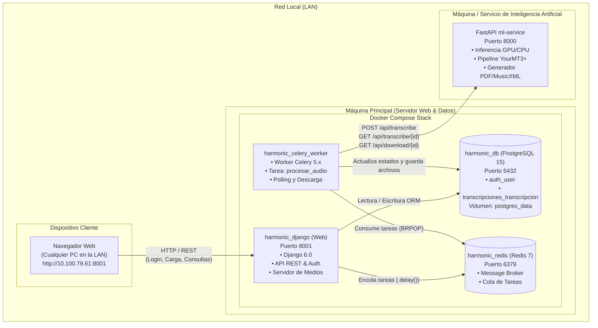
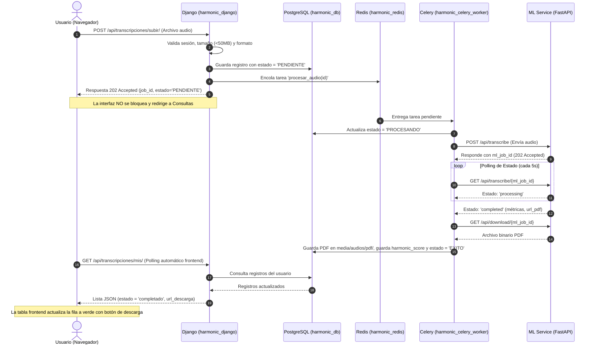
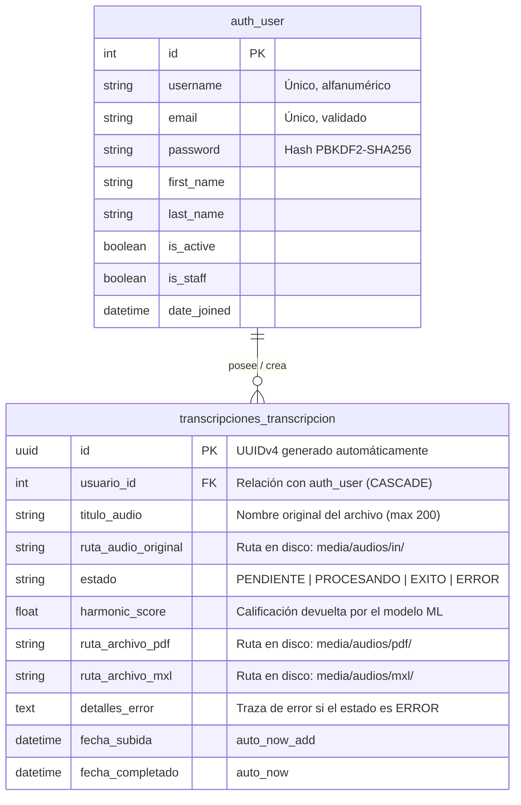

# Documentación Integral del Sistema — Harmonic Score (Arquitectura Asíncrona v2.0)

Esta documentación técnica detalla la arquitectura, decisiones de diseño, infraestructura en contenedores, esquema de base de datos, flujo de procesamiento asíncrono y los procedimientos operativos para levantar, gestionar y monitorear el proyecto **Harmonic Score**.

---

## 1. Resumen Ejecutivo y Objetivo del Sistema

**Harmonic Score** es una plataforma orientada a la transcripción automática de audio musical a partituras y formatos digitales (PDF, MusicXML) con evaluación polifónica asistida por Inteligencia Artificial (modelo *YourMT3+ MoE*).

### El Problema Técnico Inicial
El procesamiento de archivos de audio mediante modelos de Deep Learning requiere una alta demanda computacional (CPU/GPU) y tiempos de inferencia que oscilan entre 15 segundos y varios minutos. En una arquitectura web tradicional síncrona:
1. El usuario subía un archivo de audio mediante una petición HTTP POST.
2. El hilo del servidor web (Django) se quedaba bloqueado esperando a que el modelo terminara de procesar el audio.
3. El navegador web alcanzaba el límite de tiempo de espera (*HTTP Request Timeout* o *Gateway Timeout 504*), interrumpiendo la conexión.
4. El servidor colapsaba si dos o más usuarios subían archivos simultáneamente, impidiendo incluso que otros usuarios pudieran iniciar sesión o navegar por el sitio.

### La Solución Implementada (Arquitectura Asíncrona — Plan 2)
Se desacopló completamente la capa de atención web (frontend y API HTTP) de la capa de cómputo pesado (procesamiento de audio e IA). Para ello, se diseñó una **arquitectura basada en microservicios contenerizados**, implementando colas de tareas en segundo plano (*Background Tasks*) con **Celery**, un intermediario de mensajes (*Message Broker*) en memoria con **Redis**, y persistencia transaccional con **PostgreSQL**.

---

## 2. Justificación Técnica de la Arquitectura

### ¿Por qué utilizar Contenedores Docker?
Docker encapsula cada servicio junto con sus librerías, dependencias del sistema operativo y configuraciones en un entorno aislado e inmutable.
1. **Aislamiento de Entornos:** Elimina el problema de *"en mi máquina sí funciona"*. El backend de Django corre en un entorno controlado con Python 3.11, PostgreSQL en su imagen oficial de Linux, y Redis en su entorno optimizado.
2. **Reproducibilidad:** Cualquier desarrollador o servidor puede desplegar la suite completa con un solo comando (`docker compose up -d`), sin necesidad de instalar manualmente PostgreSQL, Redis o dependencias de C en el sistema anfitrión.
3. **Persistencia Controlada:** Los datos de la base de datos se desacoplan del ciclo de vida de los contenedores mediante volúmenes (`postgres_data`), garantizando que la información persista aunque los contenedores se detengan o reconstruyan.

### ¿Por qué los servicios están separados y no en un solo contenedor?
Existe una regla de oro en arquitectura de contenedores: **"Un contenedor, una responsabilidad / un proceso"**. Aunque físicamente es posible meter Django, Celery, Redis y PostgreSQL dentro del mismo contenedor usando un gestor como `supervisord`, separarlos brinda ventajas cruciales:
1. **Aislamiento de Fallos:** Si el procesamiento de un audio satura la memoria RAM o causa un error fatal, únicamente fallará el *Worker*; el servidor web de Django y la base de datos siguen vivos atendiendo a los demás usuarios.
2. **Escalabilidad Independiente:** Si la demanda aumenta a 100 usuarios simultáneos, el servidor web casi no consume recursos recibiendo peticiones, pero la cola de audios se saturaría. Con esta arquitectura, se pueden levantar 5 contenedores de *Worker* en paralelo sin clonar la base de datos ni el servidor web.
3. **Distribución Heterogénea de Hardware:** Permite que el servidor web corra en una máquina ligera (laptop o servidor web estándar) mientras que el procesamiento pesado de Machine Learning puede delegarse a una máquina equipada con GPU dedicada en la red local.

---

## 3. Catálogo de Servicios y Contenedores

| Servicio Compose | Nombre Contenedor | Imagen Base | Puerto Expuesto | Función Principal |
| :--- | :--- | :--- | :--- | :--- |
| **web** | `harmonic_django` | Custom (`backend/Dockerfile`) | `8001:8001` | Servidor HTTP Django. Maneja vistas HTML, API REST, sesiones y archivos multimedia. |
| **worker** | `harmonic_celery_worker` | Custom (`backend/Dockerfile`) | *(Ninguno - red interna)* | Proceso en segundo plano Celery. Escucha tareas de Redis, envía audios a la IA y descarga resultados. |
| **redis** | `harmonic_redis` | `redis:7` | `6379:6379` | Broker de mensajería en memoria ultrarrápido y almacenamiento temporal de tareas. |
| **db** | `harmonic_db` | `postgres:15` | `5432:5432` | Motor de base de datos relacional PostgreSQL. Persistencia de usuarios y transcripciones. |
| **ml** *(remoto/local)* | `harmonic_ml` *(o PC externa)* | Custom (`ml-service/Dockerfile`) | `8000:8000` / `5000:5000` | Servicio FastAPI que aloja el modelo de Deep Learning y orquesta la generación de partituras. |

---

## 4. Diagrama de Arquitectura del Sistema

### 4.1. Diagrama de Infraestructura y Red (Mermaid)



### 4.2. Diagrama de Secuencia del Procesamiento Asíncrono



---

## 5. Explicación de Componentes: Celery y Redis

Para comprender a fondo la arquitectura, es esencial entender el rol de cada uno de estos dos componentes:

### 1. Redis (El Message Broker / Intermediario)
* **¿Qué es?** Redis es una base de datos en memoria extremadamente rápida que funciona como una estructura de colas FIFO (*First-In, First-Out*).
* **Función en el sistema:** Actúa como el **buzón de correspondencia**. Django no puede hablar directamente con Celery en tiempo real porque Celery puede estar ocupado procesando otro audio. Django simplemente deposita un "ticket" en Redis con los datos mínimos: `{"task": "procesar_audio", "id": "uuid-del-audio"}`.

### 2. Celery (El Distributed Task Worker / Trabajador)
* **¿Qué es?** Celery es un framework de ejecución de tareas asíncronas para Python.
* **Función en el sistema:** Es el **trabajador incansable**. Está constantemente vigilando el buzón de Redis. En cuanto aparece un ticket:
  1. Lo extrae de la cola.
  2. Lee el archivo de audio físico guardado en el volumen de Django.
  3. Establece la conexión HTTP con el servicio de IA (`FastAPI`), transmite el archivo y monitorea su avance.
  4. Descarga la partitura generada y actualiza el registro en PostgreSQL.
  5. Si ocurre cualquier error (la máquina de IA se apagó, audio corrupto, etc.), Celery captura la excepción, registra el detalle en `detalles_error` y marca la transcripción como `ERROR`.

---

## 6. Cómo la Computadora Funciona como Servidor Web (Acceso LAN)

Para que cualquier laptop, teléfono o dispositivo conectado a la misma red Wi-Fi/Ethernet pueda ingresar al sistema, se realizaron configuraciones a nivel de red y servidor:

### 1. Enlace a todas las interfaces (`0.0.0.0`) vs `127.0.0.1`
* `127.0.0.1` (*localhost* o dirección de loopback) significa estrictamente *"esta misma máquina"*. Si un servidor corre en `127.0.0.1`, únicamente los navegadores dentro de esa misma computadora pueden conectarse.
* `0.0.0.0` le indica al servidor web que **escuche en todas las interfaces de red disponibles** (tarjeta de red Wi-Fi, cable Ethernet, etc.).
* **Configuración aplicada en Docker:**
  En `docker-compose.yml`, el comando de arranque de Django se configuró como:
  ```yaml
  command: sh -c "python manage.py makemigrations && python manage.py migrate && python manage.py runserver 0.0.0.0:8001"
  ```
  Y el mapeo de puertos en `ports:` vincula el puerto `8001` del anfitrión con el `8001` del contenedor (`8001:8001`).

### 2. Configuración de Host y CORS en Django
En `backend/app/settings.py` se habilitó el acceso irrestricto de orígenes para entorno de desarrollo y pruebas:
```python
ALLOWED_HOSTS = ['*']
CORS_ALLOW_ALL_ORIGINS = True
CORS_ALLOW_CREDENTIALS = True
```

### 3. Apertura del Puerto en el Firewall de Windows
Windows bloquea por defecto las conexiones entrantes desde otros dispositivos de la red. Para permitir el tráfico al puerto 8001, se ejecuta en PowerShell como Administrador:
```powershell
New-NetFirewallRule -DisplayName "HarmonicScore Web" -Direction Inbound -Protocol TCP -LocalPort 8001 -Action Allow
```

### 4. Dirección de Acceso
Cualquier dispositivo conectado al mismo módem o red local accede a través de la IP privada asignada a la máquina anfitriona:
* **Enlace:** `http://10.100.79.61:8001` *(o la IP IPv4 que indique `ipconfig`)*.

---

## 7. Arquitectura de la Base de Datos (PostgreSQL)

La base de datos utiliza el motor relacional **PostgreSQL 15**. Las tablas están normalizadas y son gestionadas mediante las migraciones del ORM de Django para garantizar la integridad referencial y prevenir inyecciones SQL.



### Descripción de Atributos Clave
1. **`id` (UUID):** Se utiliza `uuid.uuid4` en lugar de IDs enteros incrementales (1, 2, 3...) para evitar ataques de enumeración y asegurar que los identificadores de transcripción compartidos o consultados vía API sean imposibles de adivinar.
2. **`estado`:** Maneja una máquina de estados finita:
   * `PENDIENTE`: Registrado en BD y depositado en cola de Redis.
   * `PROCESANDO`: El worker de Celery ya tomó la tarea y está en comunicación con el modelo.
   * `EXITO`: El modelo generó la partitura, el PDF fue descargado con éxito y se asignó el puntaje.
   * `ERROR`: Ocurrió un fallo en validación, conexión o inferencia; el motivo queda guardado en `detalles_error`.
3. **Mapeo hacia el Frontend:** Para respetar los estilos y la interfaz ya maquetada, la API expone los estados mapeados que entiende JavaScript (`proceso`, `completado`, `error`).

---

## 8. Credenciales del Sistema y Datos de Acceso

> [!IMPORTANT]
> Estas credenciales pertenecen al entorno de desarrollo local y pruebas de red interna. Para despliegues en servidores de producción públicos, deben sustituirse por contraseñas robustas inyectadas mediante un gestor de secretos o variables de entorno restringidas.

### 8.1. Base de Datos (PostgreSQL)
* **Motor:** PostgreSQL 15
* **Host Interno (entre contenedores):** `db`
* **Host Externo (desde la máquina anfitriona):** `localhost` o `127.0.0.1`
* **Puerto:** `5432`
* **Nombre de la Base de Datos:** `harmonic`
* **Usuario:** `admin`
* **Contraseña:** `admin`
* **Volumen de Persistencia:** `postgres_data` (mapeado a `/var/lib/postgresql/data`)

### 8.2. Administrador del Sistema Django (Superusuario)
* **Panel de Administración:** `http://127.0.0.1:8001/admin/` (o `http://10.100.79.61:8001/admin/`)
* **Usuario:** `testadmin`
* **Correo:** `admin@harmonicscore.local`
* **Contraseña:** `admin1234` *(o crear uno nuevo con el comando de la sección 10)*

### 8.3. Message Broker (Redis)
* **Host Interno:** `redis`
* **Host Externo:** `localhost:6379`
* **Base de datos por defecto:** `redis://redis:6379/0`
* **Autenticación:** Sin contraseña (restringido a red Docker).

---

## 9. Seguridad y Frontend: Soluciones Recientes

### 9.1. Resolución del Error de Dominio en reCAPTCHA
* **Problema:** Al acceder desde otra computadora mediante la IP `10.100.79.61`, Google reCAPTCHA v2 mostraba el error *"ERROR for site owner: Invalid domain for site key"*, debido a que la consola de Google solo tenía registrados `localhost` y `127.0.0.1`.
* **Solución Aplicada:** En la consola de administración de Google reCAPTCHA, se desactivó la casilla de verificación de origen de dominio (*Domain Name Validation*), permitiendo que la misma clave funcione en cualquier dirección IP asignada dinámicamente por la red local sin interrumpir el flujo de validación criptográfica en backend.

### 9.2. Limpieza de Interfaz: Campos de Contraseña
* **Problema:** Los campos de contraseña utilizaban caracteres tipo emoji (`👁️` y `🔒`) en los botones de alternancia (*toggle*), generando inconsistencias visuales y aspecto informal.
* **Solución:** Se reemplazaron por texto formal interactivo:
  * Estado inicial (oculto): El botón muestra la etiqueta **`Mostrar`**.
  * Estado revelado (visible): El botón cambia dinámicamente a **`Ocultar`**.
  * Actualizado en las plantillas `login.html`, `registro.html` y en el script de interacción `validacion.js`.

---

## 10. Guía Operativa: Cómo Levantar y Gestionar el Proyecto

### Requisitos Previos
* Docker Desktop instalado y con el motor Linux/WSL2 en ejecución.
* Git.

### 10.1. Archivo de Configuración de Entorno (`.env`)
En la raíz del proyecto, el archivo `.env` define la dirección donde corre la API de Machine Learning (ya sea en la misma máquina o en una computadora externa con tarjeta gráfica):
```ini
# Si el modelo corre en otra máquina de la red local (ejemplo IP 192.168.1.50):
ML_SERVICE_URL=http://192.168.1.50:8000

# Si el modelo corre de manera local en el puerto 8000:
# ML_SERVICE_URL=http://127.0.0.1:8000
```

### 10.2. Comandos de Gestión con Docker Compose

```powershell
# 1. Construir las imágenes y levantar todos los contenedores en segundo plano
docker compose up -d --build

# 2. Verificar que los contenedores estén activos y saludables
docker compose ps

# 3. Ver los logs en tiempo real del servidor web Django
docker compose logs -f web

# 4. Ver los logs en tiempo real del worker de Celery (para ver tareas de audio)
docker compose logs -f worker

# 5. Detener todos los contenedores (preservando los datos de la base de datos)
docker compose down

# 6. Reiniciar únicamente un servicio específico tras hacer cambios de código
docker compose restart web
docker compose restart worker

# 7. Crear un nuevo superusuario de Django si es necesario
docker compose exec web python manage.py createsuperuser

# 8. Entrar a la consola interactiva de PostgreSQL (psql)
docker compose exec db psql -U admin -d harmonic
```

---

## 11. Script en Python para Generar el Gráfico de Arquitectura

Si se requiere exportar el diagrama de arquitectura a un archivo de imagen PNG o PDF para informes técnicos o presentaciones, se puede utilizar el siguiente script basado en la librería `graphviz` de Python:

```python
"""
Script para generar el diagrama de arquitectura de Harmonic Score en formato PNG.
Requiere: pip install graphviz
(Asegurarse de tener Graphviz instalado en el sistema operativo: winget install Graphviz)
"""
from graphviz import Digraph

def generar_diagrama():
    dot = Digraph('HarmonicScore_Arquitectura', format='png')
    dot.attr(rankdir='LR', size='12,8', dpi='300')
    dot.attr('node', shape='box', style='rounded,filled', fontname='Arial', fontcolor='white')

    # Nodos
    dot.node('Client', 'Cliente Web\n(Navegador en LAN)\nhttp://IP:8001', fillcolor='#2B5797')
    
    with dot.subgraph(name='cluster_host') as c:
        c.attr(label='Servidor Principal (Docker Compose)', style='dashed', color='#666666', fontname='Arial')
        c.node('Django', 'harmonic_django\n(Web API :8001)\nDjango 6.0', fillcolor='#008080')
        c.node('DB', 'harmonic_db\n(PostgreSQL :5432)\nPersistencia', fillcolor='#336791', shape='cylinder')
        c.node('Redis', 'harmonic_redis\n(Redis Broker :6379)\nCola de Tareas', fillcolor='#D83B01', shape='cylinder')
        c.node('Worker', 'harmonic_celery_worker\n(Celery Worker)\nProcesamiento Background', fillcolor='#107C41')

    dot.node('ML', 'Servidor / Servicio ML\n(FastAPI :8000)\nYourMT3+ MoE (Inferencia)', fillcolor='#5C2D91')

    # Conexiones
    dot.edge('Client', 'Django', label=' HTTP POST / GET\n(Login, Carga, Status)')
    dot.edge('Django', 'DB', label=' ORM SQL')
    dot.edge('Django', 'Redis', label=' .delay(job_id)')
    dot.edge('Worker', 'Redis', label=' Consume tareas')
    dot.edge('Worker', 'DB', label=' Actualiza estados\nGuarda PDF')
    dot.edge('Worker', 'ML', label=' Transmite Audio\nDescarga Partitura', style='bold', color='#D83B01')

    dot.render('arquitectura_harmonic_score', cleanup=True)
    print("¡Diagrama exportado exitosamente como arquitectura_harmonic_score.png!")

if __name__ == '__main__':
    generar_diagrama()
```
